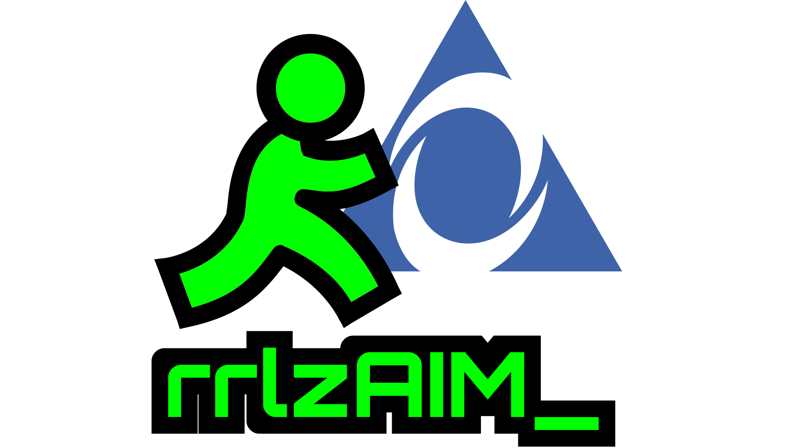

<p align="center">
  
</p>

# realretrolabz AIM Manager

Run **AOL Instant Messenger 5.9.3861** through one of two separate,
platform-specific workflows:

- **Linux / Wine:** `rrlzAIMlinux`, a guided terminal manager for Wine.
- **Native Windows:** `rrlzAIM.exe`, a self-contained setup and compatibility
  utility for Windows 11.

Both workflows acquire an original installer outside the repository and, by
default, verify its pinned identity before use. This repository never includes
or distributes AOL/AIM program files.

## Disclaimer

This project was developed with AI-assisted coding tools  and manually reviewed/tested against my own use case. Specific bug  reports, reproducible issues, and pull requests are welcome.

General debates about AI-assisted development are outside the scope of this repo.

## Supported configurations

The v0.1.x support target is deliberately narrow.

### Linux / Wine terminal manager

| Component | Supported target |
| --- | --- |
| Host | Linux graphical session |
| AIM | 5.9.3861 |
| Wine | 9.0 (runtime validated); 10.0 (source/build validated, runtime validation pending) |
| Wine prefix | 32-bit (`win32`) |
| Wine Windows version | Windows XP |
| Legacy runtime | `mfc40` |
| SuperBuddy | `sb.dll` registered with `regsvr32` |
| `aimapi.dll` | Renamed and disabled |
| Notification audio | Version-matched patched Wine `mciwave.dll` |
| DLL override | `native,builtin` |

The Linux/Wine reference setup has been used for sign-in, buddy lists, IM
send/receive, buddy icons, chat rooms, and repeated notification sounds.
Direct Connection and file transfer depend on AIM Rendezvous networking and may
require firewall or port-forwarding configuration.

### Native Windows setup utility

| Component | Supported target |
| --- | --- |
| Host | Windows 11 graphical desktop (guest-tested) |
| AIM | 5.9.3861 installed normally on Windows; the workflow is not portable |
| Compatibility change | `aimapi.dll` renamed to `aimapi.dll.aim59-disabled` |
| Server configuration | Selected host and port in the current user's AIM registry key |
| Optional cleanup | Files named `Free AOL & Unlimited Internet.lnk` on the current-user and Public Desktop(s), when selected |
| Wine-specific changes | Not used: no Wine prefix, XP mode, `mfc40` setup, `sb.dll` registration, or patched `mciwave.dll` |

The native utility has been used successfully in a Windows 11 guest, including
the observed usable-AIM-window workaround after `aimapi.dll` is disabled.
Windows 10 has not been tried and is not a support target. The broader feature
and repeated-notification-sound validation above applies to Linux/Wine only.

Other AIM, Wine, and native Windows versions are not supported unless they are
tested explicitly.

## Requirements

### Linux / Wine terminal manager

- Linux
- Python 3.10 or newer
- system Wine 9.0 or 10.0 with 32-bit support
- Winetricks
- `cabextract`
- a graphical session in which the AIM installer can run

On Debian, `wine32:i386` must be installed. The patcher reports the exact
package command before downloading AIM when Wine emits its missing-wine32
warning.

The terminal patcher checks Wine's version before creating or changing the
prefix. Consult [INSTALL.md](docs/INSTALL.md) for the manual known-good recipe.

### Native Windows setup utility

- Windows 11 with a graphical desktop
- permission to accept the EXE's UAC prompt from the account that will own the
  AIM installation and server preference
- `rrlzAIM.exe` and its adjacent `rrlzAIM.exe.sha256` file from the matching
  GitHub Release
- either Internet access to the configured OldVersion source or a separately
  obtained original AIM 5.9.3861 installer that matches the pinned identity

The release EXE is self-contained in the project sense: it needs no repository
checkout or adjacent PowerShell script. It targets the .NET Framework 4.8 line
included with Windows 11. The native workflow accepts a verified local installer
or the configured OldVersion download; unlike the Linux manager, it does not
offer a direct installer-URL option. See
[WINDOWS_INSTALL.md](docs/WINDOWS_INSTALL.md) for full installation, recovery,
and clean-snapshot guidance.

## Choose an installation path

### Linux / Wine terminal manager

The terminal release archive contains the manager and versioned Wine DLLs.
Use the checkout directly while developing:

```bash
./rrlzAIMlinux
```

The release bundle contains both versioned DLLs and selects the one that matches
the detected Wine version, so no manual `--patched-dll` argument is required.
Wine 9.0 remains runtime validated; Wine 10.0 is available as a build-validated
candidate while its repeated-sound runtime matrix is completed.

### Native Windows setup utility

`rrlzAIM.exe` (realretrolabz AIM Manager) is a self-contained Windows 11 setup
utility. Download `rrlzAIM.exe` and `rrlzAIM.exe.sha256` from the GitHub Release,
verify the EXE against its adjacent SHA-256 file, then run the EXE directly:

```powershell
$expected = (Get-Content .\rrlzAIM.exe.sha256).Split()[0]
$actual = (Get-FileHash .\rrlzAIM.exe -Algorithm SHA256).Hash.ToLowerInvariant()
if ($actual -ne $expected) { throw 'rrlzAIM.exe SHA-256 verification failed.' }
```

The utility downloads or validates the pinned original installer, runs it,
waits for `aim.exe` and `aimapi.dll` to settle, disables `aimapi.dll`, and
configures a selectable OSCAR host and port. It can reapply that server setting
without reinstalling AIM, restore its own DLL rename, and start AIM's normal
registered uninstaller.

Building from [`windows/AIM59Setup/`](windows/AIM59Setup/) is an additional
option for contributors and local testing. The prior PowerShell proof-of-concept
remains archived as historical source, not an EXE dependency. See
[WINDOWS_INSTALL.md](docs/WINDOWS_INSTALL.md) for download verification, source
builds, use, recovery, and optional clean-snapshot checks.

## Linux / Wine terminal-manager quick start

From a repository checkout, start the guided terminal manager:

```bash
./rrlzAIMlinux
```

The centered manager displays the supplied rrlzAIM header and a DOS-style menu.
It records only locations it installed itself; it never scans for existing Wine
prefixes. Choose **Install AIM** to select an AIM data directory, server, AOL
shortcut cleanup, XDG launcher, and installer source.

The selected parent defaults to `~/.local/share/rrlzAIM` (or the value of
`$AIMwineprefix`). Wine always uses its fixed child directory, `prefix`:

```text
AIM data directory: ~/.local/share/rrlzAIM
Wine prefix:        ~/.local/share/rrlzAIM/prefix
```

Guided installation defaults to `realretrolabz` on port `5190`, offers a
spacebar-toggleable removal of the exact AOL promotional shortcut, and asks
whether to create an XDG launcher. Declining the launcher leaves launching to
the manager or a manual Wine command.

If the selected directory already contains a prefix, the manager refuses to
take ownership of it. Old/manual prefixes are intentionally left alone.

The defaults are:

```text
Wine prefix:     ~/.local/share/rrlzAIM/prefix
Installer cache: ~/.cache/rrlzAIM/installers
```

When setup finishes:

```bash
./rrlzAIMlinux doctor
./rrlzAIMlinux launch
```

## Linux / Wine terminal-manager reference

### Noninteractive setup

Download the pinned installer from the configured archive:

```bash
./rrlzAIMlinux setup --source oldversion --yes
```

Use an installer already on disk:

```bash
./rrlzAIMlinux setup \
  --installer /path/to/aim593861.exe \
  --yes
```

Download from another URL:

```bash
./rrlzAIMlinux setup \
  --installer-url https://mirror.example/aim593861.exe \
  --yes
```

Choose a different AIM data directory while retaining its fixed `prefix` child:

```bash
./rrlzAIMlinux setup \
  --source oldversion \
  --aim-prefix "$HOME/.local/share/my-aim" \
  --yes
```

For automation, combine an explicit source with `--non-interactive`. Preview
the complete action plan without creating or changing a prefix with
`--dry-run`:

```bash
./rrlzAIMlinux setup \
  --source oldversion \
  --aim-prefix "$HOME/.local/share/my-aim" \
  --non-interactive \
  --dry-run
```

Unattended setup keeps AIM's existing server preference and leaves the AOL
shortcut alone unless explicitly told otherwise. To apply the realretrolabz
server and remove the optional installer shortcut:

```bash
./rrlzAIMlinux setup \
  --source oldversion \
  --server realretrolabz \
  --remove-aol-desktop-shortcut \
  --yes
```

For another server, use `--server custom --server-host HOST` and optionally
`--server-port PORT` (the default port is `5190`).

### Command reference

| Command | Purpose |
| --- | --- |
| `rrlzAIMlinux` | Open the guided terminal manager |
| `rrlzAIMlinux setup` | Acquire AIM, create a prefix, install it, and apply fixes |
| `rrlzAIMlinux fetch` | Acquire and verify the AIM installer without installing |
| `rrlzAIMlinux verify-installer` | Check a local installer's pinned identity |
| `rrlzAIMlinux sources` | List configured third-party installer sources |
| `rrlzAIMlinux patch-prefix` | Apply fixes to an existing AIM prefix |
| `rrlzAIMlinux set-server` | Set AIM's server preference in an existing Wine prefix |
| `rrlzAIMlinux uninstall` | Run AIM's uninstaller, then remove its Wine prefix |
| `rrlzAIMlinux doctor` | Check the expected files and patch state |
| `rrlzAIMlinux launch` | Start AIM from the selected prefix |

Run `./rrlzAIMlinux COMMAND --help` for every option.

#### Reapply a server setting

With AIM closed, set the next-launch server without reinstalling:

```bash
./rrlzAIMlinux set-server --server realretrolabz
./rrlzAIMlinux set-server --server custom --server-host oscar.example --server-port 5190
```

The command writes `Host` and `Port` only in AIM's per-prefix current-user
registry key. Saving AIM's own Server settings dialog can overwrite those
values, so rerun `set-server` afterwards when needed.

#### Uninstall AIM and remove its prefix

Close AIM, then run the destructive cleanup command. With no `--prefix`, it
targets the managed default prefix, `~/.local/share/rrlzAIM/prefix`:

```bash
./rrlzAIMlinux uninstall
```

It restores the patcher-owned `aimapi.dll` rename only long enough for AIM's
prefix-local `uninstll.exe` to run, waits for the uninstaller's Wine processes,
then removes the project-owned XDG entry and permanently deletes the complete
Wine prefix. It proceeds with those final deletions only when the uninstaller
exits successfully and `aim.exe` is gone. If the uninstaller is cancelled,
fails, or leaves `aim.exe`, the prefix and XDG entry are left intact and the
compatibility `aimapi.dll` disablement is restored when possible.
Deleting the prefix also discards its prefix-local recovery backups, including
any saved AOL shortcut copy.

For automation, use the explicit confirmation flag:

```bash
./rrlzAIMlinux uninstall --non-interactive --yes
```

Use `--dry-run` first to display the actions without changing the prefix.
Only supply `--prefix "$HOME/.wine-aim59"` if you deliberately installed AIM
in that custom prefix.

#### Download without installing

```bash
./rrlzAIMlinux fetch --source oldversion
```

The configured archive copy of `aim593861.exe` is pinned as:

```text
Size:    8,715,352 bytes
SHA-256: 018438bf22672ee119e864d78f838a538ed067bb76296957a00e0c1080979af1
```

The archive uses rotating download tokens. The patcher loads its stable
version page, submits the current download form, saves the result in the
external installer cache, and verifies it before Wine is allowed to execute
it.

Verify an existing installer directly:

```bash
./rrlzAIMlinux verify-installer /path/to/aim593861.exe
```

An unknown checksum stops by default. `--allow-unverified` exists for an
explicitly reviewed variant, but bypasses the main installer-identity safety
check.

#### Patch an existing prefix

If AIM 5.9.3861 is already installed under `C:\Program Files\AIM`:

```bash
./rrlzAIMlinux patch-prefix --prefix "$HOME/.wine-aim59"
```

The prefix must already be 32-bit, use Wine 9.0 or 10.0, have Windows XP mode and
`mfc40` configured, and contain `aim.exe` and `sb.dll`. The legacy wrapper is
still available and delegates to the same command:

```bash
scripts/apply-prefix-fixes.sh "$HOME/.wine-aim59"
```

#### Diagnose and launch

Commands use the default prefix unless `--prefix` is supplied:

```bash
./rrlzAIMlinux doctor --prefix "$HOME/.wine-aim59"
./rrlzAIMlinux launch --prefix "$HOME/.wine-aim59"
```

`doctor` returns a failure status when required prefix files or the recorded
patch state are missing. More targeted checks are documented in
[TROUBLESHOOTING.md](docs/TROUBLESHOOTING.md).

> **Maintainer/support recovery:** `rollback` is retained only for
> support-directed diagnosis or recovery from a partially applied patch. It
> reverses project-owned compatibility changes and leaves the prefix outside the
> supported AIM configuration; it does not uninstall AIM or remove the prefix.
> For normal removal, use `uninstall`. That command temporarily restores only
> the `aimapi.dll` rename needed to start AIM's own uninstaller, then deletes the
> managed prefix only after the uninstaller succeeds.

## Native Windows setup-utility reference

`rrlzAIM.exe` is the native Windows entry point; the `rrlzAIMlinux` commands
above do not run on Windows. After verifying the release EXE, use its graphical
workflow:

1. Accept the UAC prompt and choose either the configured OldVersion download
   or a verified local original AIM installer.
2. Choose the realretrolabz server, retain AIM's original setting, or enter a
   custom OSCAR host and port. Optional cleanup removes files named `Free AOL &
   Unlimited Internet.lnk` from the current-user and Public Desktop(s); it is
   off by default.
3. Select **Install AIM** and complete AIM's normal installer. The utility waits
   until `aim.exe` and `aimapi.dll` are stable, stops auto-launched AIM, then
   applies its reversible `aimapi.dll` rename and the selected server setting.

With AIM closed, **Apply server setting** changes the selected host and port
without downloading or reinstalling. AIM's own Server settings dialog can
overwrite that value, so use the utility again after saving that dialog when
needed.

**Restore aimapi.dll** reverses only the utility-owned DLL rename and leaves the
server preference unchanged. **Uninstall AIM...** restores that DLL first and
starts AIM's normal registered uninstaller; complete the uninstaller in its own
window because the utility does not infer its eventual result. See
[WINDOWS_INSTALL.md](docs/WINDOWS_INSTALL.md) for the exact safeguards,
recovery behavior, and source-build instructions.

## How the patchers work

`rrlzAIMlinux` and `rrlzAIM.exe` share the supported AIM version and installer
identity, but they are independent implementations. A compatibility change for
one must not be assumed to apply to the other.

### Linux / Wine terminal manager

```text
Version manifest
      |
      +-- local installer
      +-- direct URL
      `-- known archive resolver
                  |
                  v
       download and SHA-256 verification
                  |
                  v
      Wine 9.0 or 10.0 / win32 environment check
                  |
                  v
     prefix + XP mode + mfc40 + AIM installer
                  |
                  v
          prefix compatibility backend
                  |
                  v
        AIM launch / diagnostics / managed uninstall
```

#### 1. Manifest-driven installer identity

[aim-5.9.3861.json](manifests/aim-5.9.3861.json) is the Linux manager's
supported-version contract. It contains the installer filename, size and
accepted SHA-256, Wine requirements, prefix layout, Winetricks packages,
patched DLL checksum, and known source metadata.

Downloaded AOL files stay in the user's external cache. They are never copied
into the repository or included in project releases.

#### 2. Isolated Wine environment

`setup` creates a dedicated win32 Wine prefix, selects Windows XP mode, and
installs `mfc40` with Winetricks. It then runs the verified AIM installer and
checks that `aim.exe` and `sb.dll` were installed in the expected location.

#### 3. AIM compatibility changes

The Wine backend applies these prefix-local changes:

| Change | Reason |
| --- | --- |
| Register `sb.dll` | Makes AIM's SuperBuddy COM component available |
| Rename `aimapi.dll` | Avoids a Wine startup/background hang |
| Back up `mciwave.dll` | Preserves the original file for support recovery |
| Install patched `mciwave.dll` | Allows AIM's notification WAV open request |
| Set `mciwave` to `native,builtin` | Loads the prefix DLL before Wine's builtin |
| Set MCI and MCI32 WaveAudio mappings | Routes legacy WaveAudio calls correctly |
| Update `[mci]` in `system.ini` | Preserves the legacy WaveAudio mapping |
| Install an XDG application entry | Adds AIM to the Linux application menu |
| Back up selected AOL shortcut | Preserves an opted-in cleanup for support recovery |

The patcher writes its state and `system.ini` backup under:

```text
<prefix>/.rrlzAIM/
```

The patched DLLs are pinned as:

```text
Wine 9.0:  23c52cbf2d9ebafc05a5abe10609a0ed49652445318ae8499bba2e1788c57df0
Wine 10.0: 17ba9b95d64fde4ad2d98abdbc623edaa7a66c6f3815221a16aa1f3d0fe30dd2
```

#### 4. Notification-sound fix

AIM opens notification WAV files through the legacy MCI `waveaudio` device
while passing `MCI_OPEN_SHAREABLE`. Wine 9.0 and 10.0 reject that flag before
the first open with `MCIERR_UNSUPPORTED_FUNCTION`.

The source patch removes only that early rejection. Wine's existing
`nUseCount > 0` guard remains, so a real conflicting second open is still
rejected.

The built PE DLL's embedded marker is changed from:

```text
Wine builtin DLL
```

to the equal-length marker:

```text
Wine patched DLL
```

This prevents Wine from substituting its installed builtin when the prefix
copy is selected as native. The Linux/Wine implementation does not use the old
Windows XP `mciwave.dll` experiment, which played once and then caused AIM to
hang.

See [TECHNICAL.md](docs/TECHNICAL.md) for the detailed investigation and the
versioned patches in [`patches/`](patches/) for the exact source changes.

### Native Windows setup utility

The native EXE checks the same pinned AIM 5.9.3861 installer identity, but it
does not load the Linux manifest or use the Python/Wine backend. It accepts a
local original installer or resolves the configured OldVersion download, then
stores a verified download under `%LOCALAPPDATA%\rrlzAIM\installers`.

```text
verified local installer or configured archive download
                         |
                         v
              size and SHA-256 identity check
                         |
                         v
                AIM's normal Windows installer
                         |
                         v
      wait for stable aim.exe and aimapi.dll, then stop AIM
                         |
                         v
  aimapi.dll -> aimapi.dll.aim59-disabled + selected HKCU server setting
                         |
                         v
        launch AIM / reapply server / restore DLL / normal uninstaller
```

After AIM's installer writes stable `aim.exe` and `aimapi.dll` files, the EXE
stops an auto-launched AIM process, makes its reversible DLL rename, writes the
selected current-user OSCAR host and port, and can optionally remove files named
`Free AOL & Unlimited Internet.lnk` from the current-user and Public Desktop(s).
It does not set a Windows compatibility mode, install `mfc40`, register `sb.dll`,
copy a Wine DLL, or apply an `mciwave.dll` override.

**Restore aimapi.dll** restores only the EXE-owned DLL rename and deliberately
leaves the server preference unchanged. **Uninstall AIM...** restores that
rename before starting AIM's registered uninstaller; the EXE does not determine
whether the separate uninstaller eventually succeeds. The native Windows
workflow does not back up or restore the optional desktop shortcut.

## Linux / Wine loose patcher assets

The `.pyz` and DLLs remain available as implementation assets. To use the loose
assets directly, place the `.pyz` and both DLLs together and run:

```bash
python3 rrlzAIMlinux.pyz setup
```

The patcher selects the matching adjacent DLL automatically. These assets are
not used by the native Windows utility.

## Build and verification

Run the repository validation suite:

```bash
make verify
```

It checks shell syntax, Python manager tests, the terminal release archive, the
published Wine DLL structure and marker, checksums, native Windows source
checks, and diff whitespace.

Build and verify all release artifacts:

```bash
make release
```

Linux release output:

```text
dist/rrlzAIM-<version>-linux.tar.gz
dist/rrlzAIMlinux.pyz
dist/mciwave-wine9-x86-aim.dll
dist/mciwave-wine10-x86-aim.dll
dist/SHA256SUMS
```

Rebuild both versioned components from source:

```bash
make build
scripts/verify-mciwave.sh dist/mciwave-wine9-x86-aim.dll
scripts/verify-mciwave.sh dist/mciwave-wine10-x86-aim.dll
```

Output:

```text
dist/mciwave-wine9-x86-aim.dll
dist/mciwave-wine10-x86-aim.dll
```

### Native Windows executable

`make release` produces the Linux terminal assets only. Build the separately
released Windows EXE from the matching source commit on Windows:

```powershell
.\scripts\windows\build-aim59-setup.ps1
```

The output is the ignored `.build\windows-exe\rrlzAIM.exe`. A Windows release
publishes that EXE beside a SHA-256 file; it is never added to Git, `dist/`, or
the Linux archive. See [BUILD.md](docs/BUILD.md), [RELEASE.md](docs/RELEASE.md),
and [WINDOWS_INSTALL.md](docs/WINDOWS_INSTALL.md) for the platform-specific
build and release process.

## Project layout

| Path | Purpose |
| --- | --- |
| `rrlzAIMlinux` | Linux / Wine terminal-manager entry point |
| `rrlzAIM/` | Python orchestration and Wine backend used by the Linux manager |
| `manifests/` | Supported-version and installer identities |
| `binaries/` | Permitted versioned prebuilt patched Wine DLLs |
| `patches/` | Corresponding versioned Wine source patches |
| `scripts/` | Linux build, compatibility wrappers, verification tools, and Windows build scripts |
| `tests/` | Patcher unit tests |
| `windows/AIM59Setup/` | Self-contained native Windows setup-utility source |
| `docs/` | Architecture, installation, testing, and troubleshooting |

The Linux/Wine architecture is described in [ARCHITECTURE.md](docs/ARCHITECTURE.md).
The Windows 11 setup is a separate self-contained native C# EXE; it does not
change or inherit the Python/Wine backend. Its earlier PowerShell proof-of-concept
remains archived as historical source.

## Licensing and third parties

Project-authored scripts and documentation are MIT licensed.

The modified Wine `mciwave.dll` and its Wine-derived source changes are
distributed under LGPL-2.1-or-later. The corresponding patch and build
instructions remain available in this repository.

AOL Instant Messenger is proprietary third-party software and is not included
or licensed by this project. OldVersion.com is an unaffiliated optional source.
See [THIRD_PARTY_NOTICES.md](THIRD_PARTY_NOTICES.md) for details.

## Acknowledgments

Special thanks to [Open OSCAR Server](https://github.com/mk6i/open-oscar-server)
for making this possible.
